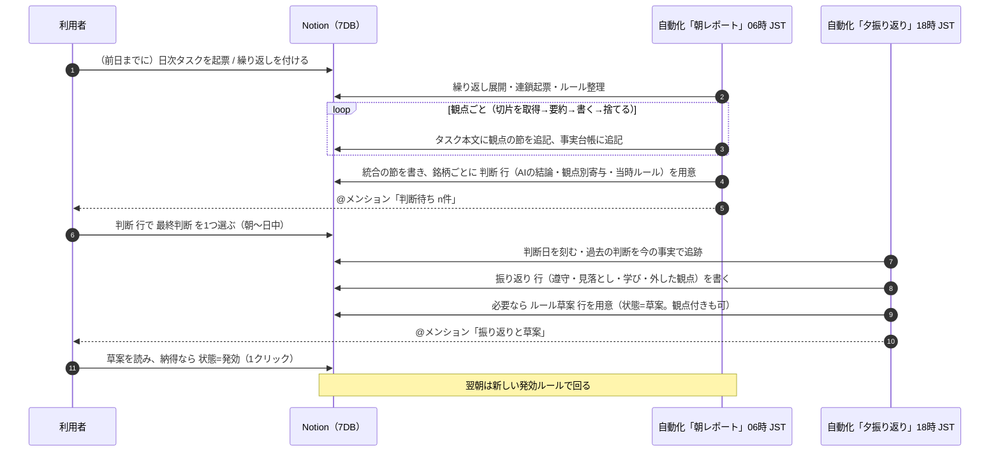
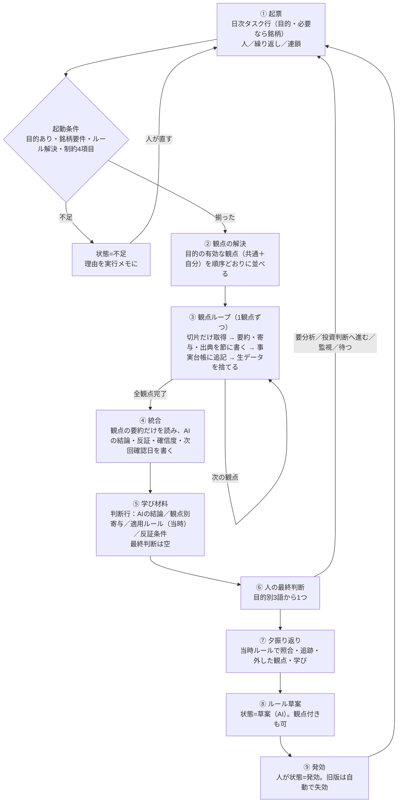
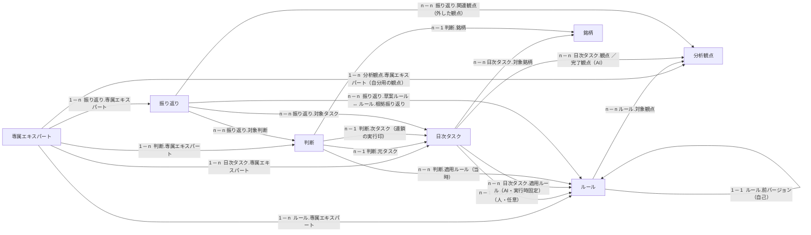

# 自己成長するAI投資家アドバイザー ― 計画書兼設計書

- 日付: 2026-09-15
- 種別: 計画書兼設計書（要件・UX・仕組み・Notionスキーマ・自動化・作る順・受け入れ条件を1冊に）
- 正本: **本書**。Notion の旧「計画書 — 要件起点」「システム設計」は本書に置き換わる（Notion 側の先頭に本書へのリンクを置く）
- 実装範囲: 本書は文書のみ。運用DBの実体作成・自動化の設置は本書に従って別途行う
- 前提（維持）: 旧計画の R1–R4、目的セレクト3値、データ入力トリガー、日次レポート＋日次振り返り、制約4項目、反証先行、AIは `買う` を書かない、執行（注文）はMVP外、既存リサーチDB群への relation なし
- 前提（新）: **参照データを一度に読むと LLM の文脈が溢れる**。よって参照データは **分析観点** ごとに切り出し、各仕事はその観点に必要な切片だけを読む（§1.4）

---

## 0. この文書の読み方

| 読者 | 読む節 |
| --- | --- |
| 利用者（メンバー） | §1 コンセプト、§2 利用者の一日、§3 仕組み、§10 表現と免責 |
| Notion を作る人 | §5 データ設計、§6 振る舞い、§8 参照資産と観点の対応、§11 作る順 |
| 自動化を設置する人 | §6 振る舞い、§7 自動化、§8 参照資産と観点の対応 |
| 旧計画を知っている人 | §4 何を変えたか、付録A 旧→新 対応表 |

詳細仕様（プロパティのオプション色、ビューのフィルタ式、テンプレ本文、各自動化のプロンプト要件）は、本書と同時に作った2つの補助文書 ― Notion スキーマ仕様 `schema-spec.md`、自動化仕様 `automation-spec.md`（プロジェクトの作業領域に置く）― にある。本書と矛盾したら本書が正。

---

## 1. コンセプトと原則

### 1.1 コンセプト（一段落）

> 人間の役割は本当に最終判断のみ。過程の情報収集等はAIが担う。AIに「ルール」を付与して仕事を与え、最終判断を人間がやり、その最終判断結果の評価をAIにやらせて、その学びを次のAIの仕事に活かす。そのループこそが、自己成長する自分専用のAI投資専門家である。

当てるAIではない。**同じ条件を何度も回し、人の判断との差分からルールを育てる装置**である（予想させるな、条件で絞らせろ）。

### 1.2 要件（正本）

| # | 要件 | 本書での実装 |
| --- | --- | --- |
| R1 | 人間は最終判断のみ | 人が触るのは **3つだけ**: ①タスク行の起票（目的・必要なら銘柄）②`最終判断` の選択 ③ルールの発効（追記・修正・削除は草案を発効することで行う） |
| R2 | ループが製品 | 起票 → 朝レポート → 判断 → 夕振り返り → ルール草案 → 発効 → 翌朝は新ルール。この輪が毎日回る |
| R3 | Notion は知識コンテナかつ設定ストア | 設定（専属エキスパート・ルール・分析観点）、知識（銘柄ページの事実台帳）、成果（日次タスク本文）、記録（判断・振り返り）をすべて Notion に置く。自動化に渡す固定値は親ページURLのみ |
| R4 | 多人数・ワークスペース可視・私有サイロなし | すべてのDBは親ページと同じ共有範囲。個人化は `オーナー` / `利用者` の列とビューで行う。他人の行は読めるが、他人の `最終判断` とルール発効は触らない |

### 1.3 二層の原則

どの目的でも、AIの出力は必ず **2つの層** を持つ。

| 層 | 置き場所 | 中身 | 誰が使う |
| --- | --- | --- | --- |
| **判断材料** | `日次タスク` 行の本文 | 人がその場で判断できる材料。観点ごとの節＋統合の節 | 人（朝、読む） |
| **学び材料** | `判断` 行（銘柄ごとに1行、**目的が違っても同じ形**） | `AIの結論` / `観点別寄与` / `最終判断`（人） / `適用ルール`（当時） / `振り返り`（後日） | ループ（夕、AIが照合する） |

学び材料が同じ形であることが、目的をまたいだ振り返りとルール改版を可能にする。

### 1.4 文脈予算の原則（分析観点）

参照データを全部読んでから考える設計は、LLM の文脈を溢れさせて止まる。本書はこれを前提に置き、次の4つで守る。

| 原則 | 意味 |
| --- | --- |
| **観点で切る** | 目的は少数の **分析観点** の組み合わせ。各観点は「どの参照資産の、どの切片（エンドポイント・項目・銘柄・期間・件数上限）を読むか」と「判断材料・学び材料に何を出すか」を宣言する |
| **全表を読まない** | 取得は必ず limit・フィルタ付き。フィルタできない資産は取得後に末尾N件へ切ってから文脈に入れる。1観点の上限を超える読み込みはしない |
| **要約が上がり、生データは残らない** | 観点ごとに「要約（≤600字）＋寄与＋出典」を書いたら生データを捨て、次の観点へ。統合は観点の要約だけを読む。生データは出典（参照資産・一次情報）に残る |
| **Notion も切って読む** | 事実台帳は最新30行、過去タスクは統合の節だけ、過去判断は同じ利用者×銘柄で20行まで、ルール本文は共通節＋該当観点の節だけ |

ルールは観点ごとに付けられる（`ルール.対象観点`、およびルール本文の `## 観点: 名前` 節）。学び材料には観点ごとの寄与が残るので、振り返りは「どの観点が外したか」を特定してその観点のルールを直せる。

---

## 2. 利用者の一日（UXから決める）

### 2.1 はじめの一歩（オンボーディング）

1. `専属エキスパート` に自分の行を1つ作り、**制約4項目**（投資期間・1銘柄あたり金額・許容損失・見ない領域）を書く。状態を `運用中` にする
2. `日次タスク` に行を1つ作り、`目的` を選ぶ。企業分析・投資判断なら `対象銘柄` も選ぶ

これだけで翌朝レポートが届く。`利用者` は空でよい（作成者から補完）。`ルール` は空でよい（自分の発効ルール → ワークスペース共通ルールの順に自動で選ばれる）。`対象日` は空でよい（当日）。観点は選ばなくてよい（目的の共通観点が使われる。自分用の観点を足したい人だけ `分析観点` に行を作る）。

### 2.2 毎日のリズム



| 時刻（JST） | 誰 | 何をする | 触る列 |
| --- | --- | --- | --- |
| 06:00 | 自動化 | 観点を順に回して判断材料を積み上げ、統合と判断行を作る | AI列のみ |
| 朝〜日中 | 利用者 | 判断材料を読み、`最終判断` を選ぶ。必要なら新しいタスクを起票 | `最終判断`（+ `判断メモ` 任意） |
| 18:00（既定。設置側で変更可） | 自動化 | 判断を当時ルールで照合、追跡、振り返り、ルール草案 | AI列のみ |
| 夕〜夜 | 利用者 | 振り返りを読む。草案に納得なら `状態=発効` | ルール `状態` |
| 翌 06:00 | 自動化 | 新ルールで回る。`監視` / `待つ` / `要分析` / `投資判断へ進む` から次のタスクが自動で立つ | — |

「振り返り」を翌朝05:30に寄せる運用も可（§7.1）。人が毎日入力するのは **判断語1つ** と、たまの **発効1クリック** に閉じる。

### 2.3 判断語彙（目的ごとに3つ）

| 目的 | 人の `最終判断` | 選んだあと自動で起きること |
| --- | --- | --- |
| スクリーニング | `残す` | 次回のスクリーニングで再質問しない（入替があれば知らせる） |
|  | `落とす` | 再提示しない（既定 90日。ルールで変更可） |
|  | `要分析` | **企業分析タスクを翌朝に起票** |
| 企業分析 | `投資判断へ進む` | **投資判断タスクを翌朝に起票** |
|  | `監視` | `次回確認日` に企業分析を再実行。変化がなければ判断を求めない |
|  | `見送り` | 再提示しない（既定 90日） |
| 投資判断（売買計画） | `買う` | 起票なし。振り返りが破綻条件と結果を追跡する |
|  | `待つ` | `次回確認日`（既定 翌営業日）に投資判断を再実行。変化なしなら判断を求めない |
|  | `見送る` | 再提示しない（既定 90日） |

判断語が次の仕事を決めるので、人は「次に何を頼むか」を別に書かない。連鎖の起票は人の判断語を実行しているだけで、AIが仕事を生成しているのではない。

---

## 3. 仕組み（1枚）

### 3.1 ループ



### 3.2 7つのDBと役割

| 群 | DB | 1行の意味 | 主に書く人 |
| --- | --- | --- | --- |
| 設定 | `専属エキスパート` | 1メンバー＝1行。制約4項目・参照資産・個人ダッシュボード。`オーナー` 空の行はワークスペース共通の既定値 | 人（初期）／AIは `直近の学び` のみ |
| 設定 | `ルール` | 1バージョン＝1行。`オーナー` 空は共通テンプレ。観点に付けてもよい | AIが草案、人が発効 |
| 設定 | `分析観点` | 1観点＝1行。目的・参照資産の切片・取得上限・出力テンプレ・有効。`オーナー` 空は共通観点 | 運営（共通）／人（自分用）／AIは触らない |
| 知識 | `銘柄` | 1銘柄＝1行。本文が **事実台帳**（全員共有、1行1事実、出典・基準日付き） | AI（台帳追記）／人（起票時に作成可） |
| ループ | `日次タスク` | 1日×1目的×（1銘柄 or 一覧）＝1行。起票であり、判断材料（本文）であり、実行記録 | 人（起票列）／AI（本文と結果列） |
| ループ | `判断` | 1タスク×1銘柄＝1行。**学び材料の同形レコード** | AI（結論・寄与・当時ルール）／人（`最終判断` だけ） |
| ループ | `振り返り` | 1利用者×1日＝1行。過去の判断を当時ルールで照合し、外した観点と学びと草案を出す | AI（草案）／人は読むだけ |

旧計画の `日次レポート` `最終判断` `知識` `学び` は吸収し、`分析観点` を新設した（§4）。ループを回す実体は 日次タスク・判断・振り返り の3本で、残りは設定と知識。

### 3.3 関係図



外部（既存リサーチDB群）への relation は **1本もない**。`目的` は relation にせず select で持つ。

---

## 4. 何を変えたか（旧計画との差分）

| # | 変更 | 理由（UX／簡潔さ／コンセプト） |
| --- | --- | --- |
| 1 | **9DB → 7DB**。`日次レポート` を `日次タスク` の本文に、`最終判断` を `判断`（AIの結論と人の判断を同じ行に）に、`知識` を `銘柄` ページの事実台帳に、`学び` を `振り返り.学び` ＋ ルール草案行に統合。`分析観点` を新設 | 1:1 の別DBは行き来の手間だけを生む。人が見る行と判断する行を一致させる。ループの実体は3本に絞る |
| 2 | **二層（判断材料／学び材料）を明文化**し、学び材料を目的横断で同形にした | 目的をまたいで「AIの結論 vs 人の判断 vs 当時ルール vs 後日」を並べられる。これが自己成長の素材 |
| 3 | **目的別の判断語彙（9語）** を人の唯一の日常入力にし、**判断語が次のタスクを起票する連鎖**を定義 | 人は「次に何を頼むか」を書かない。スクリーニング→企業分析→投資判断の階段を判断語だけで登る |
| 4 | **起票の最小入力を `目的` 1つ**に。`利用者` は作成者から、`ルール` は解決順（明示→自分の発効→共通の発効）で、`対象日` は当日で補完 | 「1行で始められる」を文字どおりにする。ルールを書けない初日でも共通ルールで回る |
| 5 | **`繰り返し`（毎営業日）** と **「変化なしは判断を求めない」** | 同じ条件を何度も回すのが評価軸。人には差分だけを見せる意思決定インボックスにする |
| 6 | **日次リズムを固定**（朝06:00 レポート／夕18:00 振り返り。翌朝05:30 も可） | 「いつ見ればいいか」を無くす |
| 7 | **ルール改版を1クリック発効に**。草案はAI、発効は人、旧版の失効は自動、`適用ルール` は実行時に固定 | 追記・修正・削除のすべてを「草案を発効する」に統一。振り返りは常に当時ルールで行える |
| 8 | **自動化前提の設計**（Cursor Automations ＋ Notion MCP）。読む順・書く順・ロック・失敗時の扱いを定義 | 無人で行を拾い、結果を書き、途中で止まらない |
| 9 | **`参照資産` 設定**を追加（共通行に既定、個人行で追加。1行1資産。認証不要のURLのみ。行ごとに `ライセンス` 階層を持ち、階層が Notion への書き方を決める） | 計算値や開示の取得元を Notion 側で差し替えられる。個人利用限定のデータを共有ワークスペースに写さない。外部の研究DBには依存しない |
| 10 | **`専属エキスパート` ページを個人ダッシュボード**に。`銘柄.状態` を廃止し、個人の状態は `判断` に置く | 「自分専用の専門家」の顔を1ページにする。共有マスタに個人状態を混ぜない |
| 11 | **`分析観点` を第一級に**。目的＝観点の組み合わせ。観点が参照資産の切片・取得上限・出力を宣言し、1観点ずつ「取得→要約→捨てる」。ルールは観点に付けられ、判断行に観点別寄与が残る | 文脈予算（§1.4）を守りながら深さを出す。振り返りが「外した観点」を特定でき、改版が局所的になる |

---

## 5. データ設計

親ページ: 「AI専属アナリスト」。7本とも通常DB、親と同じ共有範囲。各DBに **自分**（`利用者` または `オーナー` ＝ 自分）と **全員** のビューを持つ。プロパティ名は本書のとおりに作る（自動化が名前で解決する）。

凡例 ― 書く人: 人／AI／自動（Notion組込）。起動: 起票時に人が埋める必要があるか。

### 5.1 専属エキスパート（設定）

| プロパティ | 型 | 書く人 | 説明 |
| --- | --- | --- | --- |
| 名前 | title | 人 | 例 `はぴまね 専属`。共通行は `ワークスペース共通` |
| オーナー | person（1人） | 人 | **空 ＝ ワークスペース共通の既定値行**（運営が1行だけ作る） |
| 状態 | select | 人 | `設定中` / `運用中` / `休止`。`運用中` 以外は自動化が扱わない |
| 投資期間 | text | 人 | 制約① |
| 1銘柄あたり金額 | text | 人 | 制約② |
| 許容損失 | text | 人 | 制約③ |
| 見ない領域 | text | 人 | 制約④ |
| ウォッチ上限 | number | 人 | 既定 10。スクリーニングで判断行を作る上限 |
| 低確信度のサイズ | text | 人 | 既定 `通常の半分` |
| 参照資産 | text | 運営／人 | 1行1資産 `名称 | URL | 提供データ | 用途 | ライセンス`。共通行の内容に個人行の内容を **追加**（§8） |
| 直近の学び | text | AI | 最新の振り返りの `学び` を1行転記 |
| ルール / 分析観点 / 日次タスク / 判断 / 振り返り | relation（逆側） | 自動 | ダッシュボード用。各DBの `専属エキスパート` の逆 |

制約4項目のどれかが空なら、そのメンバーのタスクは `不足` になる（空の制約で回さない）。

### 5.2 ルール（1行＝1バージョン）

| プロパティ | 型 | 書く人 | 説明 |
| --- | --- | --- | --- |
| ルールID | title | 人／AI | 例 `はぴまね 投資判断 v3`、`共通 スクリーニング v1`、`はぴまね 観点:価格条件 v2` |
| オーナー | person | 人 | 空 ＝ 共通テンプレ |
| 専属エキスパート | relation → 専属エキスパート（1） | 人／AI | 共通は空 |
| 対象目的 | multi-select | 人／AI | `スクリーニング` / `企業分析` / `投資判断（売買計画）` |
| 対象観点 | relation → 分析観点（n） | 人／AI | 空 ＝ 目的全体のルール。指定あり ＝ その観点を回すときだけ読む |
| バージョン | number | 人／AI | 1, 2, 3… |
| 状態 | select | 人（発効・棄却）／AI（草案作成・前版の失効） | `草案` / `発効` / `失効` / `棄却` |
| 前バージョン | relation → ルール（1、自己） | AI／人 | 逆側 `次バージョン` |
| 根拠振り返り | relation → 振り返り（n） | AI | どの振り返りから来た草案か。逆側 `振り返り.草案ルール` |
| 発効日 | date | 人／AI | 人が空のまま発効したら AI が検知日を補完 |
| 変更要約 | text | AI／人 | 追記・修正・削除の1行 |
| 適用タスク / 適用判断 | relation（逆側） | 自動 | このバージョンで回した記録 |

本文の固定見出し（目的に応じて使う節だけ書く）: 1 選定基準（スクリーニング） / 2 除外・見ない領域 / 3 企業分析で必ず見る項目 / 4 IF-THEN（買う条件・見送り条件・破綻条件） / 5 サイズとRR / 6 再提示の間隔（既定 90日）と次回確認の既定 / 7 振り返りの見方 / 8 変更理由。観点固有の閾値は `## 観点: <観点名>` の節に書く。自動化は共通節と、いま回している観点の節だけを読む。

運用: **発効・棄却は人だけ**。同じ系（`前バージョン` でつながる列）に `発効` が2行あれば、朝の自動化が古い方を `失効` にする。行の削除はしない（削除 ＝ 失効）。

### 5.3 分析観点（設定・切片の宣言）

1観点＝1行。運営が **共通観点**（`オーナー` 空）を目的ごとに用意し、各人は自分用の観点を足せる（`オーナー` ＝ 自分）。AIはこのDBを書かない。

| プロパティ | 型 | 書く人 | 説明 |
| --- | --- | --- | --- |
| 観点名 | title | 運営／人 | 例 `受注トレンド`、`価格条件`、`反証` |
| 目的 | multi-select | 運営／人 | この観点を使う目的 |
| 順序 | number | 運営／人 | 目的内の実行順。反証系は最後、統合の直前 |
| 有効 | checkbox | 運営／人 | OFF は回さない |
| オーナー | person | 人 | 空 ＝ 共通観点 |
| 専属エキスパート | relation → 専属エキスパート（1） | 人 | 自分用の観点のみ |
| 問い | text | 運営／人 | この観点が答える問い（1行）。例 `受注は伸びているか` |
| 参照資産 | text | 運営／人 | 使う参照資産の **名称**（§8 の一覧の名称。複数は `・` 区切り。取得なしは `なし`） |
| スライス | text | 運営／人 | 切片の宣言 `銘柄=対象|全体 / 期間=… / 項目=… / 件数=… / クエリ=…`（§6.6） |
| 取得上限 | number | 運営／人 | 1回の取得で読む最大件数（行・文書）。既定 30 |
| 重さ | select | 運営／人 | `軽` / `重`。`重` は1ランに1観点だけ |
| 判断材料テンプレ | text | 運営／人 | この観点の節の見出し・並び（§6.1 の観点節の型を上書きしたいときだけ） |
| 学び材料への出力 | multi-select | 運営／人 | `寄与` / `反証条件` / `結論候補` / `確信度` / `次回確認日`。判断行のどの列に書けるか |
| 対象ルール | relation（逆側） | 自動 | `ルール.対象観点` の逆 |
| 日次タスク / 完了タスク | relation（逆側） | 自動 | `日次タスク.観点` / `日次タスク.完了観点` の逆 |
| 関連振り返り | relation（逆側） | 自動 | `振り返り.関連観点` の逆 |

本文: 自動化への短い指示（見るべき点、寄与の判定基準）。**300字以内**（本文自体が文脈を食うため）。

### 5.4 銘柄（薄いマスタ＋事実台帳）

| プロパティ | 型 | 書く人 | 説明 |
| --- | --- | --- | --- |
| 銘柄名 | title | 人／AI | 人が起票時に `6098` とだけ打って作ってもよい。AIが正規化 |
| 証券コード | text | 人／AI | 本製品内の一意キー（4桁または英数字コード） |
| 市場 | select | AI | `プライム` / `スタンダード` / `グロース` / `その他`。任意 |
| 参照URL | url | AI | 参照資産の銘柄ページなど。任意 |
| 日次タスク / 判断 | relation（逆側） | 自動 | この銘柄に関する全員の記録 |

本文 ＝ **事実台帳**。AIが `- [基準日] 種別 | 内容 | 出典URL | 品質 | 観点` の1行1事実で追記する（種別 `事実` / `計算` / `推論` / `確認不能`、品質 `正常` / `要確認` / `欠損`）。既存行は書き換えず、訂正は新しい行で。自動化は最新30行だけを読む。個人の状態（監視中など）は持たない。

### 5.5 日次タスク（起票＝判断材料）

| プロパティ | 型 | 書く人 | 起動 | 説明 |
| --- | --- | --- | --- | --- |
| タスク名 | title | 人（空可）→AI | 任意 | AIが `YYYY-MM-DD 目的 銘柄` に命名 |
| 目的 | select | 人 | **必須** | `スクリーニング` / `企業分析` / `投資判断（売買計画）` |
| 対象銘柄 | relation → 銘柄（n） | 人 | **企業分析・投資判断で必須** | スクリーニングは空 |
| 利用者 | person | 人 | 任意 | 空なら `作成者` を使う |
| 作成者 | created_by | 自動 | — | 利用者の既定 |
| 対象日 | date | 人 | 任意 | 空なら実行日 |
| ルール | relation → ルール（1） | 人 | 任意 | 明示したいときだけ。空なら解決順で選ぶ |
| 観点 | relation → 分析観点（n） | 人（任意）→AI | 任意 | 人が絞りたいときだけ指定。空なら AI が目的の有効な観点（共通＋自分）を解決して書き込む |
| 繰り返し | select | 人 | 任意 | `なし`（既定） / `毎営業日`。翌営業日に同じ内容の行が自動で立つ |
| 状態 | status | AI | 既定 `未着手` | `未着手` / `実行中` / `レポート済` / `不足` |
| 完了観点 | relation → 分析観点（n） | AI | — | 節を書き終えた観点。進捗と再開に使う |
| 適用ルール | relation → ルール（n） | AI | — | 実行時に固定（目的ルール＋観点ルール）。振り返りはこれで行う |
| 専属エキスパート | relation → 専属エキスパート（1） | AI | — | 利用者から解決 |
| 変化 | select | AI | — | `初回` / `あり` / `なし`。`なし` は判断行を作らない |
| 要約 | text | AI | — | 1行。ビューで読む |
| 判断待ち | rollup | 自動 | — | `判断` の `最終判断` が空の件数 |
| 判断 / 振り返り | relation（逆側） | 自動 | — | |
| 実行メモ | text | AI | — | 実行ID・時刻・進捗（観点 k/m）・不足の理由 |

本文 ＝ 判断材料（§6.1）。観点ごとに節を **追記** し、統合の節を書いたら完成。完成前は先頭に `作成中（k/m 観点）` を置き、完成後は数字を書き換えない。

### 5.6 判断（学び材料・同形レコード）

| プロパティ | 型 | 書く人 | 説明 |
| --- | --- | --- | --- |
| 判断ID | title | AI | `YYYY-MM-DD 目的 銘柄 利用者名` |
| 元タスク | relation → 日次タスク（1） | AI | |
| 銘柄 | relation → 銘柄（1） | AI | |
| 目的 | select | AI | タスクから転記 |
| 利用者 | person | AI | タスクの利用者（空なら作成者） |
| 専属エキスパート | relation（1） | AI | |
| 適用ルール | relation → ルール（n） | AI | **当時ルール**（目的ルール＋観点ルール） |
| AIの結論 | select | AI | スクリーニング `通過` / `除外`；企業分析 `有利寄り` / `中立` / `回避寄り`；投資判断 `条件成立` / `押し目待ち` / `監視のみ` / `見送り`；共通 `確認不能` |
| 観点別寄与 | text | AI | `観点名:寄与` を `／` 区切り。寄与は `有利` / `中立` / `不利` / `確認不能`。例 `受注トレンド:有利／開示の流れ:中立／反証:不利` |
| AIの一言 | text | AI | 結論の理由1行。企業分析・投資判断は「買わない理由」を先に |
| 確信度 | select | AI | `高` / `中` / `低` |
| 反証条件 | text | AI | この結論が崩れる条件 |
| **最終判断** | select | **人だけ** | §2.3 の9語。AIは絶対に書かない |
| 判断メモ | text | 人（任意） | |
| 判断日 | date | AI | `最終判断` を初めて検知した日を刻む。以後変更しない |
| 次回確認日 | date | AI（人が変更可） | `監視` / `待つ` の再実行日。既定は目的別（§6.3） |
| 次タスク | relation → 日次タスク（1） | AI | 連鎖で起票した行。二重起票の防止 |
| 振り返り | relation → 振り返り（n） | AI | 後日の照合 |
| 追跡メモ | text | AI | 振り返りごとに最新の追跡結果を1行で上書き（唯一の更新可能列） |

`条件成立` は「発効ルールのIF節が事実として成立した」という報告であり、買う指示ではない。

### 5.7 振り返り（1利用者×1日）

| プロパティ | 型 | 書く人 | 説明 |
| --- | --- | --- | --- |
| 振り返りID | title | AI | `YYYY-MM-DD 振り返り 利用者名` |
| 対象日 | date | AI | |
| 利用者 | person | AI | |
| 専属エキスパート | relation（1） | AI | |
| 対象タスク | relation → 日次タスク（n） | AI | 当日レポート済のタスク |
| 対象判断 | relation → 判断（n） | AI | 当日の判断＋追跡中の過去判断 |
| 関連観点 | relation → 分析観点（n） | AI | 人の判断と食い違った・外したと見た観点 |
| ルール遵守 | select | AI | `○` / `×` / `混在` / `該当なし` |
| 見落とし | text | AI | 1行 |
| 学び | text | AI | 1行の仮説。`専属エキスパート.直近の学び` に転記 |
| ルール対応 | select | AI（提案） | `変更なし` / `追記` / `修正` / `削除` |
| 草案ルール | relation → ルール（n） | AI | 起こした草案。観点付きなら `対象観点` を入れる。発効は人 |
| 未判断件数 | number | AI | 判断待ちの数（催促はこの数字だけ） |
| 小サンプル | checkbox | AI | 照合対象が10件未満なら ON。学びを断定しない |

### 5.8 ビュー（各DB共通の2つ＋要所）

| DB | ビュー | フィルタ・並び |
| --- | --- | --- |
| 全DB | 自分 | `利用者` または `オーナー` ＝ 自分（Notion の「Me」） |
| 全DB | 全員 | フィルタなし。作成日降順 |
| 日次タスク | 今日 | `対象日` ＝ 今日。状態でグループ |
| 判断 | 判断待ち（自分） | `最終判断` 空 かつ 利用者＝自分。目的でグループ |
| 判断 | 履歴（自分） | `最終判断` あり。目的→判断日降順 |
| ルール | 発効中 | `状態` ＝ 発効。オーナーでグループ |
| 分析観点 | 目的別 | `有効` ON。目的でグループ、順序昇順 |
| 振り返り | 最新 | 対象日降順 |

### 5.9 ページテンプレ

| DB | テンプレ | 中身 |
| --- | --- | --- |
| 日次タスク | 新しいタスク | 本文の先頭に「目的を選ぶだけ。企業分析・投資判断は対象銘柄も。あとは翌朝」の1行 |
| ルール | ルール本文 | §5.2 の固定見出し＋`## 観点: ` の例 |
| 分析観点 | 観点 | 「問い／見る点／寄与の判定基準」の3見出し（300字以内の注意書き付き） |
| 銘柄 | 銘柄 | 見出し「事実台帳」と1行1事実の凡例 |
| 専属エキスパート | 専属 | 制約4項目の記入案内と、この行に紐づく `ルール（発効）` `自分の観点` `今日の日次タスク` `判断待ち` `最新の振り返り` のリンクドビュー（フィルタ「専属エキスパート がこのページを含む」） |

---

## 6. 振る舞い（目的別の型と完了条件）

### 6.1 判断材料の型（日次タスク本文）＝ 枠 ＋ 観点の節 ＋ 統合

```
[頭] @利用者 判断待ち n件（判断DBへのリンク）／ 適用ルール（ID・バージョン）／ 制約との一致 ／ 変化（初回・あり・なし）
[観点の節 × m]  ## 観点: <観点名>
                 要約（≤600字。事実・計算・推論を分ける）
                 寄与: 有利 / 中立 / 不利 / 確認不能（1語＋理由1行）
                 根拠: 出典URL・取得日時・読んだ件数（上限と実件数）
                 確認不能: あれば列挙
[統合]          ## 統合
                 目的別の結論の型（下表）。観点の要約だけから書く
[尾]            確認不能の一覧 ／ 出典一覧 ／ 免責1行
```

| 目的 | 共通観点（既定。順序どおり。§8.3 に切片） | 統合の節に書くもの | 完了条件（判断材料） | 完了条件（学び材料） |
| --- | --- | --- | --- | --- |
| スクリーニング | ① 受注トレンド ② 海外売上比率 ③ 優待・還元（任意） ④ 制約と既判断（取得なし。候補の和集合に制約・既判断・ウォッチ上限を当てる） | 一覧表: コード・銘柄・残した条件（どの観点で通過したか）・根拠・前回との入替 ／ 落とした主な銘柄と理由 ／ 既判断（残す済・落とす済は再質問しない） | 全有効観点が節を持つ（確認不能でも節はある）。一覧に根拠と出典があり、おすすめ文がない。件数 ≤ ウォッチ上限 | `通過` 銘柄ごとに判断行（`AIの結論` `観点別寄与` `AIの一言` `適用ルール`）。既判断は作らない |
| 企業分析 | ① 受注・海外の推移 ② 開示の流れ ③ 一次情報（重） ④ 株主還元・優待（任意） ⑤ 反証（取得なし。①〜④の要約から買わない理由3つ） | 事実／計算／推論の分離 ／ **買わない理由3つ**（推論より先） ／ 推論（`有利寄り` / `中立` / `回避寄り`） ／ 次に確認する日 | 全有効観点が節を持つ。反証が先、`確認不能` が残っている。`買う` がない | 判断行1（`AIの結論` `観点別寄与` `確信度` `反証条件` `次回確認日`） |
| 投資判断（売買計画） | ① 企業分析の継承（Notionのみ。直近の企業分析の統合節だけ） ② 価格条件（personal-only。成立／未成立のみ） ③ 需給（personal-only。成立／未成立のみ） ④ 直近開示 ⑤ サイズと破綻条件（取得なし。制約とルールから、金額で） ⑥ 反証（取得なし） | IF-THEN（買う条件／見送り条件／破綻条件。条件であって指示ではない） ／ エントリー帯（ルールの基準に対する条件。値は書かない） ／ サイズ提案（**金額**で。式を示す。低確信度は通常サイズを出さない） ／ 確信度と分類 | 全有効観点が節を持つ。IF-THEN・エントリー帯・破綻条件・サイズがあり、発注指示・`今すぐ買う`・personal-only の値がない | 判断行1（`AIの結論` ∈ 条件成立/押し目待ち/監視のみ/見送り、`観点別寄与`、`反証条件`、`次回確認日`） |
| 変化なし（繰り返し・再確認） | 観点は回すが、各節は「前回と差分なし」の1行でよい | 前回タスクへのリンク、変化がない根拠、次回確認日 | 短く。`変化` ＝ `なし` | **判断行を作らない**（前回の判断が生きている） |

観点の追加・無効化は `分析観点` の行で行う。目的の型そのもの（枠・統合・完了条件）は本書の改訂で変える。

### 6.2 語彙の対応（AIと人）

| 目的 | 観点の寄与（材料の部品） | AIの結論（材料） | 人の最終判断（決定） |
| --- | --- | --- | --- |
| スクリーニング | 有利 / 中立 / 不利 / 確認不能 | 通過 / 除外 / 確認不能 | 残す / 落とす / 要分析 |
| 企業分析 | 同上 | 有利寄り / 中立 / 回避寄り / 確認不能 | 投資判断へ進む / 監視 / 見送り |
| 投資判断（売買計画） | 同上 | 条件成立 / 押し目待ち / 監視のみ / 見送り / 確認不能 | 買う / 待つ / 見送る |

統合の既定（ルールで上書き可）: 企業分析は `不利` が `有利` 以上なら `回避寄り`、`有利` が過半で反証が軽ければ `有利寄り`、それ以外は `中立`。投資判断は 価格条件が `成立` かつ 反証が `不利` でなければ `条件成立`、価格条件が `未成立` なら `押し目待ち`、反証が `不利` なら `見送り`、企業分析の継承が `確認不能` なら `監視のみ`。確信度は `確認不能` の観点数と寄与の割れ具合で下げる。

AIは `買う` `買い推奨` `今すぐ` `必ず` `絶対` `爆益` を本文にも `AIの一言` にも書かない。

### 6.3 連鎖と再確認の既定

| 人の判断 | 自動化の動き | 次回確認日の既定 |
| --- | --- | --- |
| 要分析 | 企業分析タスクを起票（同じ利用者・銘柄） | 翌営業日 |
| 投資判断へ進む | 投資判断タスクを起票 | 翌営業日 |
| 監視 | 企業分析タスクを再起票 | 5営業日後（ルール本文で変更可） |
| 待つ | 投資判断タスクを再起票 | 翌営業日 |
| 残す / 落とす / 見送り / 見送る / 買う | 起票なし | — |

再起票の結果が `変化なし` なら判断行を作らず、`次回確認日` を同じ間隔で先送りする。`買う` 行は振り返りが破綻条件と結果を追跡する（personal-only の価格は成立／未成立で書く）。

### 6.4 振り返りの型（振り返り本文）

① 今日の判断の記録（AIの結論 vs 最終判断、一致／不一致） ② 追跡（開いている `監視` `待つ` `買う` 行を今の事実で確認。破綻条件に触れたら明記） ③ ルール遵守（当時ルールに対して） ④ 外した観点（不一致の判断について、`観点別寄与` のどれが人の判断と逆を向いていたか。`関連観点` に relation） ⑤ 見落とし ⑥ 学び（仮説。小サンプルなら断定しない） ⑦ ルール対応の提案（変更なし／追記／修正／削除。観点付きの草案ならその観点を `対象観点` に） ⑧ 未判断件数。

振り返りは **`適用ルール`（当時）** に対して行う。今日の発効ルールで過去を再審しない。振り返りも文脈予算を守る（対象判断は当日分＋追跡中のみ、各判断の材料は統合節と観点別寄与だけを読む）。

### 6.5 ルールのバージョン運用

1. AIは草案を **本文を丸ごと持った新行**（`状態=草案`、`前バージョン`＝現行、`根拠振り返り` あり、`変更要約` あり、観点固有なら `対象観点` あり）として作る。追記・修正・削除の違いは `変更要約` と本文差分で表す
2. 人は読んで `状態=発効`（納得しないなら `棄却`、または放置）
3. 朝の自動化が同系の旧 `発効` を `失効` にし、`発効日` が空なら補完する
4. 翌朝以降のタスクは新版を `適用ルール` に固定する。過去の判断・振り返りの `適用ルール` は変わらない

人がルール本文を直接編集したい場合も、新行を作って発効する（発効中の行の本文は書き換えない）。

### 6.6 データ予算（既定値。分析観点の行で個別に絞れる）

| 単位 | 上限 | 備考 |
| --- | --- | --- |
| 1観点の取得件数 | 既定 30、最大 100 | `取得上限` 列。limit／件数パラメータで要求し、無い資産は取得後に切る |
| 1観点の項目数 | 12 | `スライス` の `項目=` に列挙した項目だけを文脈に入れる |
| 1観点の期間 | 5年（時系列は末尾120営業日、需給は8週） | `スライス` の `期間=` |
| 1観点の文書数 | 2（`重`） | EDINET・TDnet の PDF/本文。読む節を `スライス` に書く |
| 1観点の出力 | 要約 ≤600字 ＋ 寄与1語 ＋ 根拠3行 ＋ 確認不能 | 本文の節。これが統合の入力になる |
| 1ランの観点数 | `軽` は 8 まで、`重` は 1 | 超えたら `実行中` のまま `完了観点` を残し、次のランで再開 |
| Notion の読み | 事実台帳 最新30行／過去タスク 統合節のみ／過去判断 20行／ルール 共通節＋該当観点の節／観点本文 300字 | 自動化は必要なプロパティだけを取得する |
| 全表の読み込み | 禁止 | limit・フィルタのない取得はしない。切れない資産は `重` にして末尾N件へ切る |

スライスの書式: `銘柄=対象|全体 / 期間=<例 5年・120営業日・8週・12ヶ月> / 項目=<カンマ区切り> / 件数=<n> / クエリ=<例 ?metric=orders&minYears=3&limit=30> / 節=<文書の読む節>`。使わない鍵は省く。

---

## 7. 自動化（Cursor Automations ＋ Notion MCP）

LLM は Cursor Automations（定時／トリガーで起動するクラウドエージェント）として動き、Notion MCP で読み書きする。設定ダッシュボードの操作は本書の範囲外。ここでは **各自動化が何をするか** を定める。

### 7.1 一覧

| 名前 | トリガー | 読む | 書く | 触らない |
| --- | --- | --- | --- | --- |
| **朝レポート** | cron 06:00 JST 月–金（UTC `0 21 * * 0-4`）。設置側で1日複数回（例 07:30／12:30／16:30 JST）に分けてよい。準備は冪等なので毎回行ってよい | 親ページ配下の7DB。`運用中` の専属、発効ルール、有効な観点、`未着手`/`実行中（再開）`/`不足` のタスク、`繰り返し` の前日タスク、連鎖対象の判断行、銘柄の事実台帳（最新30行）、参照資産の切片 | ルール整理（旧版失効・発効日補完）→ 繰り返し展開 → 連鎖起票 → 各タスクを観点ごとに（節・事実台帳・完了観点）→ 統合・結果列・判断行 → @メンション | `最終判断` `判断メモ` `状態=発効` `分析観点` |
| **夕振り返り** | cron 18:00 JST 月–金（UTC `0 9 * * 1-5`。設置側で 19:00 などに変えてよい）。翌朝運用なら 05:30 JST（UTC `30 20 * * 0-4`） | 当日レポート済タスク（統合節）、判断行（当日＋開いている過去）、当時ルール、追跡に要る観点の切片 | `判断日` 補完、`追跡メモ`、振り返り行（関連観点）、草案ルール行、`直近の学び`、@メンション | 同上 |
| **随時実行**（任意） | Notion のDBオートメーション「日次タスクに行が追加された／目的が設定された」→ Webhook。または 09–17時の毎時ポーリング（UTC `0 0-8 * * 1-5`） | 対象行だけ（`未着手` と再開待ちの `実行中`） | 朝レポートの「実行」段だけを対象行に行う | 同上 |

自動化に渡す固定値は **親ページ「AI専属アナリスト」のURLだけ**。DBは親ページ配下を名前で解決する。

### 7.2 朝レポートの手順

0. **ルール整理**: 同系に `発効` が2行以上 → 最新以外を `失効`。`発効` で `発効日` 空 → 当日を補完
1. **準備**: (a) 前営業日の `繰り返し=毎営業日` タスク（`レポート済`）を当日分として複製（休場日は複製しない） (b) `最終判断` が `要分析` / `投資判断へ進む` で `次タスク` 空 → 起票して `次タスク` を刻む (c) `監視` / `待つ` で `次回確認日 ≤ 今日` かつ `次タスク` 空 → 再起票 (d) `不足` の行を再評価し、揃っていれば `未着手` へ
2. **実行**（`未着手`、および進捗のある `実行中` の各行。`対象日 ≤ 今日`。上限 10行／ラン、残りは次のランへ）:
   1. `状態=実行中`、`実行メモ` に実行IDと時刻（ロック。進捗の更新が60分以上ない `実行中` は放棄とみなして引き継ぐ）
   2. 起動条件を検査（目的・銘柄要件・利用者→専属が `運用中`・制約4項目・ルール解決）。欠けたら `不足` と理由
   3. **観点の解決**: `観点` が空なら、目的を含む有効な観点（共通＋この利用者の分）を `順序` で並べ、`観点` に書く。`完了観点` にある観点は飛ばす
   4. **観点ループ**（1観点ずつ。`軽` は 8 まで、`重` は 1 で打ち切り、残りは次のランへ）:
      1. 読む: 専属（制約・参照資産の該当行）→ 該当ルール（目的ルールの共通節 ＋ この観点の節 ＋ `対象観点` がこの観点のルール）→ 観点本文 → 銘柄の事実台帳（最新30行）→ 同じ利用者・目的・銘柄の前回タスクの統合節 → 参照資産の **切片だけ**（`スライス` どおりに limit・項目・期間を絞る。絞れない応答はシェルで切ってから文脈に入れる）
      2. 書く: タスク本文に `## 観点: 名` の節を追記（要約・寄与・根拠・確認不能。ライセンス階層を守る）→ 事実台帳に新しい事実を追記（commercial-ok / factual-cite のみ）→ `完了観点` に追加 → `実行メモ` に進捗
      3. 捨てる: 生データを文脈から捨て、次の観点へ
   5. **統合**: 観点の節（要約・寄与）だけを読み、目的別の統合の節を書く（§6.1）。書く前に禁止語と personal-only の値の混入を自己検査
   6. 判断行を作る（既存の元タスク×銘柄があれば作らない。`変化=なし` なら作らない）。`観点別寄与` を書く
   7. `適用ルール` `専属エキスパート` `変化` `要約` `タスク名` を埋め、先頭の `作成中` を外し、`状態=レポート済`
3. **通知**: 本文冒頭で `@利用者` に「判断待ち n件」

### 7.3 夕振り返りの手順（利用者ごと）

1. `最終判断` あり・`判断日` 空 → `判断日` を刻む
2. 開いている判断（`監視` `待つ` `買う`、および当日の全判断）を今の事実で追跡し `追跡メモ` を1行更新（追跡に要る切片だけを取得。personal-only は成立／未成立）
3. 当日のレポート本文を検査する（禁止語、`personal-only` の数値の混入、`最終判断` への AI 書き込みの痕跡）。見つけたら振り返りの「見落とし」に書く
4. 振り返り行を1つ作る（§6.4）。対象タスク・対象判断・関連観点を relation で結ぶ（判断行の `振り返り` が埋まる＝4スロット目）
5. ルール対応が `追記` / `修正` / `削除` なら草案行を作る（§6.5-1）。`変更なし` なら作らない
6. `専属エキスパート.直近の学び` を更新。`@利用者` に振り返りと草案を知らせる

### 7.4 ガードレール（全自動化共通）

- `最終判断` `判断メモ` `ルール.状態=発効／棄却` `分析観点` を **書かない**。人の判断語を推測して埋めない
- 禁止語を書かない。書く前に自分の下書きを検査する
- 事実には出典URLと基準日。取れない数字は `確認不能`。推測で埋めない。一次情報（EDINET・TDnet・会社IR）と参照資産が食い違えば一次情報を優先し、その旨を書く
- 参照資産は `ライセンス` の階層に従って書く（§8）。`personal-only` の値・`no-store` の文章を Notion に転記しない。`factual-cite` は事実の短い引用と出典URLまで
- **文脈予算を守る**（§6.6）。全表を読まない。1観点の切片を超えて取得しない。観点を終えたら生データを捨てる。統合は観点の節だけから書く
- 企業分析・投資判断は反証（買わない理由）を推論より先に書く
- 未発効ルール・他人のルールで回さない。既存リサーチDB群を読まない・relation しない
- 冪等: 判断行は元タスク×銘柄で一意、連鎖起票は `次タスク` で一意、複製は当日分の有無で判定、観点の節は `完了観点` で二重書きを防ぐ
- 失敗したら `不足` に理由を書いて終える。`実行中` で放置しない（進捗のある `実行中` は再開待ちとして許す）
- 計算は式を明示する。数字の物語化（「急騰」「爆発的」）をしない
- 1ランの処理上限を守り、超過分は `実行メモ` に残して次のランへ
- 休場日は `繰り返し` を展開しない。人が手で起票した行は処理してよい

詳細（プロンプト要件、検査項目、失敗コード、観点ごとの取得手順）は `automation-spec.md`。

---

## 8. 参照資産と観点の対応

**参照資産** ＝ 自動化が「出典として読んでよい」外部データの一覧。Notion（`専属エキスパート.参照資産`）が正本で、共通行に運営が既定を書き、個人行に各人が追加する。1行1資産。観点は参照資産を **名称** で指し、切片（`スライス`）で「どこまで読むか」を絞る。

```
名称 | URL | 提供データ | 用途（目的） | ライセンス
```

| 規則 | 内容 |
| --- | --- |
| 認証 | **不要なURLのみ**。鍵やトークンは Notion に書かない（D1 REST など認証が要る経路は、必要になったら自動化側の秘密情報で持ち、本設定にはURLだけを書く） |
| 位置づけ | 計算値・加工データの出典。一次情報（EDINET・TDnet・会社IR）を置き換えない |
| 引用 | 本文・事実台帳に URL と取得日時を書く。到達できなければ `確認不能` |
| ライセンス | 行ごとに階層を持つ。階層が Notion への書き方を決める（§8.1）。共有ワークスペースに置けない値は **読んでも書かない** |
| 切片 | 参照資産の行は「何が取れるか」、観点の `スライス` は「どこまで読むか」。全表を読む観点は作らない |
| 変更 | 行を足す・消すだけ。自動化のプロンプトは変えない |

### 8.1 ライセンス階層と書き方

| ライセンス | 意味 | Notion への書き方 |
| --- | --- | --- |
| `commercial-ok` | 再配布可の公的データ（EDINET由来など） | 数値・要約を出典付きで書いてよい |
| `factual-cite` | 事実の引用は可、本文の転載は不可（TDnet由来など） | 事実を短く、出典URL付きで。PDF本文の転載・長い要約はしない |
| `personal-only` | 個人利用限定（Yahoo・JPX由来の株価・指標・信用残高など） | **値を書かない**。ルール条件との関係（成立／未成立）と確認先だけを書く |
| `no-store` | 保存不可（ニュース本文の一部など） | 参照資産に載せない。読まない |

### 8.2 既定の行（共通行に運営が書く）

kabulab-cf（Cloudflare Workers 版 kabulab。GitHub `satoki252595/kabulab_tool_cloudflare`）の公開 JSON API と一次情報から始める。認証が要る D1 REST は使わない。`{code}` は証券コード。

```
kabulab 有報定量検索 | https://kabulab-cf.satoki252595.workers.dev/yuho-quant/api/screening | 受注高・受注残高のスクリーニング（EDINET由来, JSON） | スクリーニング・企業分析 | commercial-ok
kabulab 有報定量検索（海外） | https://kabulab-cf.satoki252595.workers.dev/yuho-quant/api/screening-overseas | 海外売上高比率（EDINET由来, JSON） | スクリーニング・企業分析 | commercial-ok
kabulab 有報定量検索（推移） | https://kabulab-cf.satoki252595.workers.dev/yuho-quant/api/trend/{code} | 受注・海外売上の最大5年推移（EDINET由来, JSON） | 企業分析 | commercial-ok
kabulab IR Catalog | https://kabulab-cf.satoki252595.workers.dev/ir-catalog/api/stock/{code} | 適時開示の時系列・タグ・ポジ／ネガ（TDnet由来, JSON） | 企業分析・投資判断 | factual-cite
kabulab お宝優待 | https://kabulab-cf.satoki252595.workers.dev/otakara-yutai/api/screening | 優待銘柄一覧とスコア（優待内容＝factual-cite、price/per/pbr/利回り/rsi14/スコア＝personal-only, JSON） | スクリーニング | factual-cite
kabulab VWAP 日足 | https://kabulab-cf.satoki252595.workers.dev/vwap-analysis/api/daily?code={code} | 日足10年（Yahoo由来, JSON） | 投資判断 | personal-only
kabulab VWAP 5分足 | https://kabulab-cf.satoki252595.workers.dev/vwap-analysis/api/intra?code={code} | 5分足VWAP（Yahoo由来, JSON） | 投資判断 | personal-only
kabulab 信用残高 | https://kabulab-cf.satoki252595.workers.dev/vwap-analysis/api/margin?code={code} | 週次信用残高（JPX由来, JSON） | 投資判断 | personal-only
EDINET | https://disclosure2.edinet-fsa.go.jp/ | 有価証券報告書（一次） | 企業分析 | commercial-ok
TDnet | https://www.release.tdnet.info/ | 適時開示（一次） | 全目的 | factual-cite
```

`personal-only` の行は、投資判断の IF-THEN やエントリー帯を **成立／未成立** で判定するために読む。株価・RSI・信用倍率などの値そのものは本文にも事実台帳にも書かず、「参照資産『kabulab VWAP 日足』で確認（値は転記しない）」と確認先を書く。人は自分の証券口座やツールで値を見る。載せる行を変えたいときは、この設定を変えるだけでよい。

### 8.3 共通観点 → 切片（既定。`分析観点` の共通行としてそのまま登録する）

| 目的 | 順序 | 観点名 | 参照資産（名称） | スライス（項目は応答の実フィールド名） | 取得上限 | 重さ | 学び材料への出力 |
| --- | --- | --- | --- | --- | --- | --- | --- |
| スクリーニング | 1 | 受注トレンド | kabulab 有報定量検索 | `銘柄=全体 / 項目=code,name,sector,years,latestOrdersYen,latestBacklogYen,ordersCagr,backlogCagr,ordersYoy,backlogYoy,hasYearGap / 件数=30 / クエリ=?metric=orders&minYears=3&limit=30` | 30 | 軽 | 寄与 |
| スクリーニング | 2 | 海外売上比率 | kabulab 有報定量検索（海外） | `銘柄=全体 / 項目=code,name,sector,years,latestRatioPct,ratioChangePp,overseasCagr,overseasYoy / 件数=30 / クエリ=?minYears=3&limit=30` | 30 | 軽 | 寄与 |
| スクリーニング | 3 | 優待・還元（任意・既定OFF） | kabulab お宝優待 | `銘柄=全体 / 項目=code,name,sector,benefitMonths,genres,benefitSummary(先頭80字) / 件数=30 / クエリ=?limit=30&sort=total&order=desc（perMax・pbrMax・yieldMin はルールから）`。price/per/pbr/利回り/rsi14/スコアは絞り込みに使うが書かない | 30 | 軽 | 寄与 |
| スクリーニング | 9 | 制約と既判断 | なし（Notion のみ） | 候補の和集合 → `見ない領域`（sector）・既判断（同じ利用者、90日）・ウォッチ上限 | — | 軽 | 結論候補 |
| 企業分析 | 1 | 受注・海外の推移 | kabulab 有報定量検索（推移） | `銘柄=対象 / 期間=5年 / 項目=stock.code,stock.name,stock.sector,documents[].periodEnd,documents[].parseStatus,points[],hasStructuredData / 件数=10`。`hasStructuredData=false` なら寄与 `確認不能` | 10 | 軽 | 寄与 |
| 企業分析 | 2 | 開示の流れ | kabulab IR Catalog | `銘柄=対象 / 期間=12ヶ月 / 項目=disclosures[].pubdate,title,primaryTag,tags,pdfSentiment,documentUrl / 件数=30（最新から）` | 30 | 軽 | 寄与 |
| 企業分析 | 3 | 一次情報 | EDINET・TDnet | `銘柄=対象 / 文書=直近の有報1＋直近の決算短信1（②の documentUrl から） / 節=事業等のリスク・経営者による分析・業績予想 / 件数=2` | 2 | 重 | 寄与・反証条件 |
| 企業分析 | 4 | 株主還元・優待（任意・既定OFF） | kabulab お宝優待 | `銘柄=対象 / 項目=benefitMonths,genres,benefitSummary / 件数=1`（一覧から対象コードを抽出。数値は書かない） | 1 | 軽 | 寄与 |
| 企業分析 | 9 | 反証 | なし（節の要約のみ） | ①〜④の要約から買わない理由3つ・反証条件・次に確認する日 | — | 軽 | 反証条件・確信度・次回確認日 |
| 投資判断 | 1 | 企業分析の継承 | なし（Notion のみ） | 同じ利用者×銘柄の直近の企業分析タスクの統合節（≤600字）と判断行 | 1 | 軽 | 寄与 |
| 投資判断 | 2 | 価格条件 | kabulab VWAP 日足 | `銘柄=対象 / 期間=末尾120営業日 / 項目=date,close,volume / 件数=120`。応答は全期間なのでシェルで末尾120行に切ってから読む。IF-THEN の価格条件を成立／未成立で判定。値は書かない | 120 | 軽 | 寄与・結論候補 |
| 投資判断 | 3 | 需給 | kabulab 信用残高 | `銘柄=対象 / 期間=8週 / 項目=weeks[].week,buy,sell,buy_chg,sell_chg / 件数=8 / クエリ=?code={code}&n=8`。ルールの需給条件を成立／未成立で判定。値は書かない | 8 | 軽 | 寄与 |
| 投資判断 | 4 | 直近開示 | kabulab IR Catalog | `銘柄=対象 / 期間=30日 / 項目=disclosures[].pubdate,title,primaryTag,documentUrl / 件数=10` | 10 | 軽 | 寄与 |
| 投資判断 | 5 | サイズと破綻条件 | なし（専属・ルール） | `1銘柄あたり金額`・`許容損失`・`低確信度のサイズ` と IF-THEN から、サイズを金額で、破綻条件を条件文で | — | 軽 | 結論候補・次回確認日 |
| 投資判断 | 9 | 反証 | なし（節の要約のみ） | 買わない理由3つ・反証条件 | — | 軽 | 反証条件・確信度 |

観点名・参照資産名は `分析観点` と `参照資産` の行と一致させる。項目名は kabulab-cf の応答（2026-09 時点）に合わせた。フィールドが変わったら `分析観点` の行を直す。

---

## 9. マルチユーザーと可視性

| 項目 | 方針 |
| --- | --- |
| 共有範囲 | 7DBとも親ページと同じ。行単位の私有にしない |
| 個人化 | `専属エキスパート.オーナー`、`ルール.オーナー`、`分析観点.オーナー`、`日次タスク.利用者`（空なら作成者）、`判断.利用者`、`振り返り.利用者` |
| 他人の行 | 読める。他人の `最終判断` とルール発効は編集しない（運用規約） |
| 共通テンプレ・共通観点 | `オーナー` 空のルール・観点。個人の学びや観点を共通に上げるかは運営が決める |
| 事実 | 銘柄ページの事実台帳は全員で1つ。解釈（判断・振り返り）は個人ごと |
| 参照資産 | 共通行の既定に、個人行の追加分を足す |

---

## 10. 表現と免責（絶対ルール）

- 投資助言をしない。AIの出力は材料であり、`最終判断` は常に人
- AIは `買う` `買い推奨` `今すぐ買う` `必ず` `絶対` `爆益` を書かない。AIの語彙は §6.2 のみ
- 事実・計算・推論・確認不能を混ぜない。取れない数字は `確認不能`
- 急騰・一過性の利益は減点。数字を物語にしない
- 執行（発注・自動売買・証券API）は成果物にしない
- 既存の調査DB・レポートページを知識の正本にしない

---

## 11. 作る順と受け入れ条件

| フェーズ | 作るもの | 受け入れ |
| --- | --- | --- |
| 0 前提 | 本書を正本にする。旧Notion2ページの先頭にリンク | 既存リサーチDBへの依存が0。執行・予想ジョブがバックログにない |
| 1 骨格 | 7DBと relation（§5）、自分／全員ビュー、テンプレ、共通の専属行（参照資産）、共通ルール v1（3目的）、共通観点（§8.3） | `目的` だけ入れた行が作れる。制約が空の専属では `不足` になる、と手順に書いてある。各観点の切片URLが疎通する |
| 2 手動ラン | 3目的それぞれ1行を、エージェントを手で起動して通す | 3目的とも §6.1 の判断材料（全観点の節＋統合）と学び材料が揃う。各観点の取得が `取得上限` 内。本文に `買う` と personal-only の値がない。`変化なし` で判断行が増えない |
| 3 自動化 | 朝レポート・夕振り返りを設置。1人で5営業日回す | 毎朝レポート、毎夕振り返りが人手なしで付く。進捗のない `実行中` の放置がない。`重` の観点が次のランで再開される |
| 4 改版 | 振り返り → 草案（観点付き） → 発効 → 翌朝の `適用ルール` が新版 | 旧版が `失効`、過去の判断の `適用ルール` は変わらない。判断語から企業分析・投資判断が連鎖起票される。`関連観点` が振り返りに残る |
| 5 2人目 | 2人目の専属行。`利用者` 空の起票。自分用の観点1つ | 作成者で個人化される。他人の判断が読め、他人のルール・観点は適用されない |
| 6 随時（任意） | Webhook または毎時ポーリング。参照資産・観点の拡充 | 日中の起票が当日中にレポート済になる |

横断の受け入れ: ①人の日常入力が「起票・最終判断・発効」に閉じている ②毎日レポート、毎日振り返り ③判断行が目的横断で同形 ④`適用ルール` が当時のまま残る ⑤外部DBへの relation がない ⑥執行が成果物でない ⑦どの観点も全表を読まず、1観点の取得が上限内。

---

## 12. リスクと回避

| リスク | 回避 |
| --- | --- |
| 参照データを読み過ぎて文脈が溢れ、途中で止まる | 観点で切る。切片と上限を `分析観点` に宣言。観点ごとに要約して捨てる。統合は節だけを読む。`重` は1ラン1観点 |
| 観点が増えて浅く広くなる | 目的ごとに共通観点は5つ前後。追加は「問い」が言えるものだけ。順序で反証を最後に固定 |
| 自動化が `最終判断` を埋めてしまう | ガードレールで書き込み禁止。夕振り返りで「AI編集の痕跡」を検査（判断日補完以外の変更を警告） |
| 判断待ちが溜まって放置される | 催促は `未判断件数` の数字だけ。`変化なし` で判断を求めない。ウォッチ上限で件数を絞る |
| 二重起票・二重判断行・二重の節 | `次タスク`、元タスク×銘柄、`完了観点` の一意性で冪等にする |
| 起票直後に自動化が走り `不足` になる | Webhook は「目的が設定された」を条件に。`不足` は毎ランで再評価するので人は列を直すだけ |
| ルールを直接書き換えて当時ルールが失われる | 発効中の本文は編集しない運用。改版は新行。`適用ルール` は relation で固定 |
| 目的を増やして完了条件が溶ける | select は3値のまま。深さは観点で足す。新しい型が要るなら本書を改訂してから |
| 参照資産に鍵を書く | 認証不要のURLだけ。鍵は自動化側の秘密情報 |
| 個人利用限定のデータが共有ワークスペースに転記される | `ライセンス` 階層（§8.1）。`personal-only` は成立／未成立と確認先だけ。夕振り返りで本文に数値の混入がないか検査 |
| 参照資産のフィールド名が変わって観点が壊れる | 観点は `確認不能` を返して止まらない。振り返りが `確認不能` の連続を検知し、運営に観点の修正を促す |
| DBを増やしたくなる | 7本で回らない具体例が出るまで増やさない。迷ったら列か観点で足す |

---

## 13. 範囲外

- コードの実装、運用DBの実体作成、自動化ダッシュボードの設定手順（別担当）
- 証券API・発注・自動売買、保有資産や収入を使う助言
- 既存リサーチDB（個別株リサーチ、銘柄選定の観点、StockFactor、メンバー向けコンテンツ）への relation・転記・依存
- 「AI開始」専用ページ、私有DB、プロンプト全文の製品化
- kabulab-cf の D1／R2 への認証付きアクセス

---

## 付録A 旧→新 対応表

| 旧（9DB） | 新（7DB） | 備考 |
| --- | --- | --- |
| 銘柄 | 銘柄 | `状態` を廃止。本文が事実台帳（観点列を追加） |
| 専属エキスパート | 専属エキスパート | `参照資産` `直近の学び` を追加。`既定の目的` `現行ルール` を廃止（ルールは解決順で選ぶ） |
| ルール | ルール | `利用者` `種別` `根拠学び` を廃止（`オーナー` 空＝共通で表す）。`バージョン` を number に。`対象観点` を追加 |
| （新設） | 分析観点 | 目的を構成する観点。参照資産の切片・取得上限・出力を宣言 |
| 日次タスク | 日次タスク | `完了条件` を廃止（本書 §6.1 が定義）。`繰り返し` `観点` `完了観点` `変化` `要約` `判断待ち` `実行メモ` を追加。`適用ルール` を複数に。状態を4値に |
| 日次レポート | （日次タスクの本文） | 1:1 を統合。観点の節＋統合 |
| 知識 | （銘柄ページの事実台帳） | 1行1事実。列は行内の区切りで表す |
| 最終判断 | 判断 | AIの結論と人の最終判断を同じ行に。全目的で作る。`観点別寄与` を追加。`AI所見との差` は振り返りが本文で扱う |
| 振り返り | 振り返り | `目的フィルタ` `ベンチマーク対比` を本文へ。`学び` `未判断件数` `関連観点` を追加 |
| 学び | （振り返り.学び ＋ ルール草案行） | ルール化の状態はルール行の `状態` が持つ |

## 付録B 用語

| 語 | 意味 |
| --- | --- |
| 起票 | `日次タスク` に行を作ること。仕事を与える唯一の操作 |
| 判断材料 | タスク本文。観点の節＋統合。人がその場で決めるための材料 |
| 学び材料 | `判断` 行。AIの結論・観点別寄与・人の判断・当時ルール・後日の振り返りを同じ形で持つ記録 |
| 分析観点 | 目的を構成する問いの単位。参照資産の切片・取得上限・出力を宣言する |
| 切片（スライス） | 観点が読む範囲。エンドポイント・項目・銘柄・期間・件数上限 |
| 寄与 | 観点が結論に与える向き。有利／中立／不利／確認不能 |
| 統合 | 観点の要約だけからAIの結論・反証・確信度・次回確認日を書く節 |
| 文脈予算 | 1観点・1ランで文脈に入れてよい量。全表を読まない |
| 当時ルール | `適用ルール`。実行時に固定したルールのバージョン群 |
| 連鎖 | 人の判断語（要分析・投資判断へ進む・監視・待つ）から次のタスクが自動で立つこと |
| 変化なし | 前回と材料が変わらないこと。判断を求めない |
| 参照資産 | 自動化が出典として読んでよい外部データの一覧（Notion が正本） |
